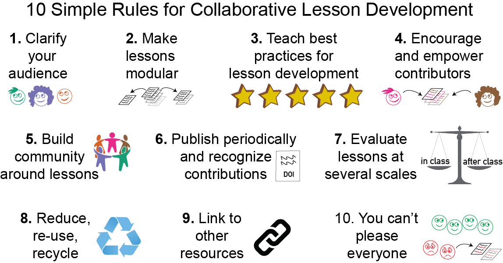

# collaborative-lesson-development

A [10 Simple Rules][10-simple-rules] paper on collaborative lesson development.
All material can be re-used under the [Creative Commons - Attribution][license] license.

Lessons take significant effort to build,
and even more effort to maintain.
The collaborative code development methods pioneered by the open source community
offer a way forward,
allowing us to create lessons which are open,
accessible,
and continually updated and improved by a community of contributors.
This paper provides ten simple rules that can help others create sustainable lessons.

Graphical Abstract.

[10-simple-rules]: http://collections.plos.org/ten-simple-rules
[license]: LICENSE.md
