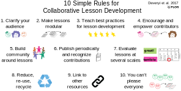

# Ten Simple Rules for Collaborative Lesson Development

Gabriel A. Devenyi1,
Rémi Emonet2,
Rayna M. Harris3,
Kate L. Hertweck4,
Damien Irving5,
Ian Milligan6,
Greg Wilson7*

1. Douglas Mental Health University Institute, McGill University / gdevenyi@gmail.com
2. Univ Lyon, UJM-Saint-Etienne, F-42023, France / remi.emonet@univ-st-etienne.fr
3. The University of Texas at Austin / rayna.harris@utexas.edu
4. The University of Texas at Tyler / khertweck@uttyler.edu
5. CSIRO Oceans and Atmosphere / irving.damien@gmail.com
6. University of Waterloo / i2millig@uwaterloo.ca
7. Rangle.io / gvwilson@third-bit.com (corresponding author)

These authors contributed equally to this work.

## Abstract

The collaborative development methods pioneered by the open source
software community offer a way to create lessons that are open,
accessible, and sustainable. This paper presents ten simple rules for
doing this drawn from our experience with several successful projects.

## Author summary

Lessons take significant effort to build and maintain. We have found
that the collaborative development methods pioneered by the open source
software community are an effective, economical way to create and
sustain lessons that can be used by large numbers of people in a wide
variety of contexts. The ten simple rules outlined in this paper
summarize the best practices that we have helped evolve in several
successful open education projects aimed at researchers and research
librarians in a wide range of disciplines.

## Introduction

Lessons take significant effort to build and even more to maintain. Most
academics do this work on their own, but leveraging a community approach
can make educational resource development more sustainable, robust, and
responsive. Treating lessons as a community resource to be updated,
adapted, and improved incrementally, can free up valuable time while
increasing quality.

Despite the success of openness in software development and the curation
of Wikipedia, it is an uncommon approach in accademic settings. Each
year, thousands of university lecturers teach subjects ranging from
first year biology, to graduate-level courses in Indian film. Some use
textbooks written by one or a few authors, but beyond that, they develop
and maintain their course materials in isolation. This is curious given
that research depends critically on sharing, and that most researchers
complain about how much time teaching takes away from research, but the
sociology and pscyhology behind this blind spot are out of the scope of
this paper.

The authors have many years of experience with community-developed
lessons in the context of research computing in the sciences and
humanities through organizations like Software Carpentry and Programming
Historian. Software Carpentry was founded in 1998 to teach scientists
basic computing skills, and has since spawned two sibling organizations
called Data Carpentry and Library Carpentry. Programming Historian was
founded in 2008, and has evolved into a collaboratively-edited site
providing lessons to humanities scholars. Their guiding principles are
that lessons should be:

1.  open and easily accessible, and

2.  continually maintained, refined, and improved by a community of
    contributors.

All open education projects satisfy the first criterion by definition,
but few satisfy the second. While their lessons are occasionally updated
by a small team (as happens when a new edition of a book is edited and
published), this is not the same as continuous improvement by a large
community of contributors. The ten simple rules that follow summarize
what we have learned about doing that.

## 1) Clarify your audience

The first requirement for building lessons together is to know who they
are being built for. ``Archaeology students'' is far too vague: are you
and your collaborators thinking of first-year students who need an
introduction to the field, graduate students who intend to specialize in
the sub-discipline which is the lesson's focus, or someone in between?
If different contributors believe different things about prerequisite
knowledge, equipment or software required, or how much time learners
will have, they will find it difficult to work together.

Rather than itemizing prior knowledge and learning objectives, it can be
helpful to write *learner profiles* to clarify the learner's general
background, what they already know, what *they* think they want to do,
how the material will help them, and any special needs they might have.
This technique is borrowed from user interface design, and a typical
learner profile is presented in Box 1.

## 2) Make lessons modular

Every instructor's needs are different, so build small chunks that can
be re-purposed in many ways. A university lecturer in meteorology, for
instance, might construct a course for their students by bringing
together lessons on differential equations, fluid mechanics, and
absorption spectroscopy. Creating courses this way shifts the
instructor's burden from writing to finding and synthesizing, which are
easier if lessons clearly define what they cover
(Rule 1), and if lessons have been designed by people
with a shared world-view (Rule 3).

One way to achieve this is to take existing courses and break them down
into smaller, single-purpose modules (a change which has pedagogical and
administrative advantages in its own right). When this is done, these
modules can be made more discoverable by referencing specific points in
the model curricula promulgated by many professional societies. Smaller
modules are also more approachable for new contributors
(Rule 4).

## 3) Teach best practices for lesson development

Decades of pedagogical research has yielded many insights into how best
to build and deliver lessons [hlw]. Unfortunately, many college and
university faculty have little or no training in education
[brownell], so this knowledge is rarely applied in the classroom.

Our experience is that even a brief introduction to a few key practices
helps collaborative lesson development. If people have a shared
understanding of how lessons should be developed, it is easier for them
to work together. Less obviously, if people have a shared model of how
lessons will be *used*, they are more likely to build reusable material.
Finally, teaching people how to teach is a great way to introduce them
to each other and build community.

One popular lesson development methodology is presented in
[wiggins-mctighe]. When this is used, lessons are built by:

1.  identifying learning objectives,

2.  creating *summative assessments* to determine whether those
    objectives have been met,

3.  designing *formative assessments* to gauge learners' progress and
    give them a chance to practice key skills,

4.  putting those formative assessments in order,

5.  and only then writing lessons to connect each to the next.

This method is effective in its own right, but its greatest benefit is
that it gives everyone a framework for collaboration.

An example of how to teach these practices is Software Carpentry's
instructor training program. First offered in 2012, is now a two-day
course delivered both in-person and online
[lessons-learned, instructor-training, how-to-teach-programming].
This program teaches good pedagogical practices, and introduces everyone
who takes it to who Software Carpentry's lessons are for, how they are
delivered, and how they are maintained. Largely as a result of this
training, several hundred people per year now contribute to Software
Carpentry's lessons.

## 4) Encourage and empower contributors

Making the process for contributing to a lesson simple and transparent
is the key to receiving contributions. Licensing, code of conduct,
governance, and the review and publication process must all be explicit
rather than implicit to lower the social barriers to contribution.

Tools can help, especially if they allow proposed changes to be viewed
and discussed prior to their incorporation into the lessons. (In
software development this is known as ``pre-merge review''.) However, some
tools that are popular in open source software development have
considerable up-front learning costs. Portals like GitHub, for example,
support everything that open lesson development needs, but require
contributors to use Git, which has a notoriously steep learning curve
[git-survey]. Google Docs and wikis do not support pre-merge review,
but their low barrier to entry make them more welcoming to newcomers.

The best way to choose tools for managing lessons is to ask potential
contributors what they are comfortable with rather than requiring *them*
to come to *you*. Remember also that contributing to a lesson is
probably not their top priority, and look for ways to reduce their
cognitive load. For example, threaded discussion forums can improve the
signal-to-noise ratio by reducing long reply-all email exchanges.
Several open frameworks are available to facilitate development of new
lessons, such as R-based learnr (<https://rstudio.github.io/learnr>) or
GitHub-based Morea (<https://morea-framework.github.io>) and DataCamp's
templates (<https://www.datacamp.com/teach/documentation>).

## 5) Build community around lessons

Software versions and dependencies are constantly changing, while the
academic literature is advancing at an ever-increasing pace. As a
result, what is cutting edge one year may be out of date the next and
simply wrong the year after. Collaborative lesson development groups
must therefore focus on creating a community in which contributors
support each other rather than on relying on a small group of stewards.
Authors cannot be expected to maintain continual vigilance on a lesson,
but this is necessary for continual use.

A key part of doing this is to create opportunities for legitimate
peripheral participation. Curating a list of small tasks that newcomers
can easily tackle, encouraging them to give feedback on proposed
changes, or asking them to add new exercises and tweak diagrams and
references can all provide an on-ramp for people who might question
their authority or ability to change the main body of a lesson. Equally,
acknowledging all contributions, however small, gives new contributors
an early reward for taking part.

Finally, working in the open can be great, but can also unintentionally
suppress voices. Programming Historian makes an ombudsperson is
available for private chats and facilitation to ensure that no one is
excluded.

## 6) Publish periodically and recognize contributions

Like software, specific versions of lessons should be published or
released periodically so that learners or instructors have something
stable to refer to for the duration of their use. Periodic releases also
provide an opportunity for recognizing the contributions of new authors
and maintainers.

Academia has only a few ways of recognizing contributions. Until these
are expanded, it is important to publish lessons in ways that
traditional academic systems can digest. One is to give releases DOIs
supplied by providers such as Zenodo (<https://zenodo.org/>) or DataCite
(<https://www.datacite.org/>). Contributors can be listed as authors and
the maintainers of the lesson as editors to differentiate recognition of
their contributions. Each time the lesson is published, names (and
identifiers such as ORCIDs (<https://orcid.org>)) should be gathered for
all contributors.

A lesson release is a good opportunity to bring the material into a
stable shape by fixing outstanding issues and merging contributions.
Version control automatically maintains a list of contributors, and can
also be used to track what content is in what release (e.g., using
branches or tags). Lesson releases should use a consistent naming
scheme; Software Carpentry has used the year and month of release (e.g.,
``2017.05'') in its releases [shell2015, shell2017].

If lessons are being released regularly, automate the process and
archive old versions in a discoverable location. Also make sure that
everyone involved knows what ``done'' look like, i.e., which outstanding
issues have to be addressed and how it has to be formatted in order for
the next release to go out. A simple checklist stored with the lesson
materials is good enough to start, but as time goes by, the community
may want to use an issue tracking system of some sort so that work items
can be assigned to specific people and then ticked off as they are
completed.

## 7) Evaluate lessons at several scales

What people immersed in developing lessons think needs fixing can easily
differ from what learners think. It is therefore critical to gather and
act on feedback at several scales to check assumptions and stay on
course.

Micro-scale feedback can be gathered by an instructor while teaching a
particular lesson. Learners can provide feedback on everything from
typographical errors and the clarity of quiz questions to the order in
which topics are presented, all of which the instructor should record at
the end of each class in some shared location (such as a Google Doc or
GitHub issues). As well as encouraging direct verbal feedback, it's a
good idea to provide learners with a means to provide feedback
anonymously during class (e.g., on small pieces of paper like sticky
notes or through anonymous surveys).

Pre- and post-class surveys should be used to uncover larger issues,
particularly those arising from developers not fully understanding their
audience, e.g., assuming prior knowledge that learners do not have.
Post-class surveys are most effective when conducted 30-90 days after
class; this gives people time to reflect, so their feedback will more
accurately reflect what they learned rather than how entertained they
were.

## 8) Reduce, re-use, recycle

Just as a scholar would not write a paper without a literature review,
an instructor should not create a new lesson if there is an existing one
they could use or contribute to. A short online search can discover if
someone has written what you need, whether it is complementary to your
goals, and if it can be tweaked or modified to meet your needs.

Before re-using content, make sure to check its license. Both
Programming Historian and the Carpentry projects use the Creative
Commons-Attribution license
(<https://creativecommons.org/licenses/by/4.0/>), which allows people to
share and adapt material for any purpose as long as they cite the
original source. Other Creative Commons licenses may restrict commercial
use and/or creation of derivative materials.

The question of licensing also arises when recycling lesson components
such as images, data, figure, or code. If the license does not cover
them explicitly, ask permission as you would for any other academic
material.

The converse of this rule is to make the license for your lessons
explicit and discoverable. For example, when lessons are published
(Rule 6), make sure that that keywords such as ``CC-BY''
appear in their bibliography entries and HTML page headers.

## 9) Link to other resources

Learners are unlikely to absorb everything they need to know about a
topic from your lesson alone. This is partly a matter of scope-any
interesting subject is too large to fit in a single lesson-but also a
matter of level and direction. As Caulfield has argued
[choral-explanations], the best way to use the Internet is to provide a
chorus of explanations that offer many angles and approaches for any
given topic, each of which may be the best fit for a different set of
needs.

Collaboratively-developed lessons should direct learners to these
resources at strategic points. Textbooks, technical documentation,
videos, web pages, threads on Quora or mailing lists: if a community or
discussion forum exists for the topic, it is worth including.

Doing this is substantial work, and maintaining it is even more so,
which makes building community around lessons (Rule 5)
all the more important. In particular, it is vital to engage the
learners as equal participants in that community: they should both be
able to propose updates, corrections, and additions to lessons, and know
that they are encouraged to do so (Rule 4).

## 10) You can't please everyone

No single lesson can be right for every learner. Two people with no
prior knowledge of a specific subject may still be able to move at
different speeds because of different levels of general background
knowledge. Similarly, lessons on ecology for learners in Utah and
Vietnam will probably be more relatable if they use different examples.
A community may therefore maintain several differently-oriented or
differently-paced lessons on a single topic, just as programming
languages provide several different libraries for doing the same general
thing with different levels of performance and complexity.

Similarly, no lesson development community can serve all purposes. Some
groups may prioritize rapid evolution, while others may prefer a
``measure twice, cut once'' approach. If there are complementary ways to
explain something, or points of view that can cohabit respectfully, it
may be possible to present them side by side. There are good pedagogical
reasons to do this even if contributors *do not* disagree: weighing
alternatives fosters higher-order thinking.

But sometimes choices must be made. The open source software community
has wrestled with these issues for three decades, and has evolved some
best practices to address them [producing-oss]. As discussed in
Rule 4, the first step is to have a clear governance
structure and a clear, permissive license. Minor disagreements should be
discussed openly and respectfully. If they turn out not to be so minor
after all, contributors should split off and evolve the lesson in the
way they see best. (This is one of the reasons to have a permissive
license.)

These splits rarely happen in practice. When they do, it is important to
remember that we all share the same vision of better lessons, built
together.

## Conclusion

Every day, teachers all over the world spend countless hours duplicating
each other's work. These ten rules provide an alternative: adopting the
model of collaborative software development to make more robust and
sustainable lessons that can be continually improved by those who use
them. We hope that our experiences can help others teach more with more
impact and less effort.

## Bibliography

[hlw] Ambrose SA, Bridges MW, DiPietro M, Lovett MC, Norman MK. How Learning
Works. Jossey-Bass; 2010.

[brownell] Brownell S. E. and Tanner K. D.: Barriers to faculty pedagogical change:
Lack of training, time, incentives, and...tensions with professional
identity? CBE Life Sciences Education, 11(4), 2012,
10.1187/cbe.12-09-0163.

[choral-explanations] Caulfield M. Choral Explanations; 2016.
<https://hapgood.us/2016/05/13/choral-explanations/>.

[shell2015] Devenyi G. A. and Koch C. (eds.): Software Carpentry: The Unix Shell;
2015. <https://zenodo.org/record/27355#.WS8lajOZPdQ>.

[shell2017] Devenyi G. A. and Srinath A. (eds.): Software Carpentry: The Unix Shell;
2017. <https://zenodo.org/record/278226#.WS74tTOZPdQ>.

[producing-oss] Fogel K. Producing Open Source Software. O'Reilly; 2005.

[git-survey] GitLab Global Developer Survey.
<http://get.gitlab.com/global-developer-survey/>, 2016.

[instructor-training] Koch C. and Wilson G. (eds.) Software Carpentry: Instructor Training;
2016. <https://zenodo.org/record/57571#.WS8huDOZPdQ>.

[wiggins-mctighe] Wiggins G, McTighe J. Understanding by Design. 2nd ed. Association for
Supervision and Curriculum Development; 2005.

[lessons-learned] Wilson G. Software Carpentry: Lessons Learned. F1000Research, 3(62),
2016, 10.12688/f1000research.3-62.v2.

[how-to-teach-programming] Wilson G. How to Teach Programming (And Other Things). Lulu.com; 2017.

## Box 1: Learner Profile

Jorge has just moved from Costa Rica to Canada to study agricultural
engineering. While fluent in both Spanish and English, he has a hearing
disability that sometimes makes it hard for him to understand lectures,
particularly in noisy environments. Other than using Excel, Word, and
the Internet, Jorge's most significant previous experience with
computers is helping his sister build a WordPress site for the family
business.

Jorge needs to measure properties of soil from nearby farms using a
handheld device that sends text files to his computer. Right now, Jorge
has to open each file in Excel, crop the first and last points, and
calculate an average. This workshop will show Jorge how to write a
little Python program to read the data, select the right values from
each file, and calculate the required statistics.
